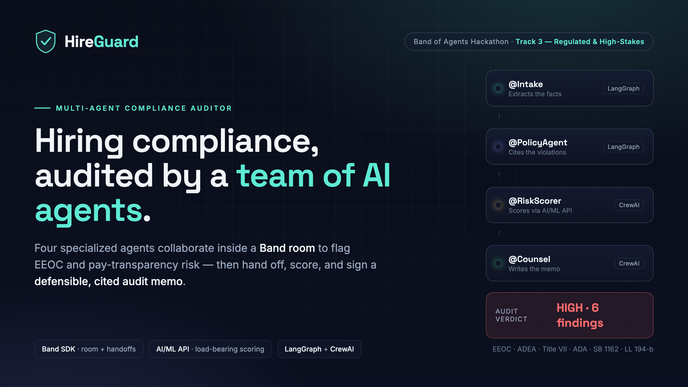

# HireGuard — Multi-Agent Hiring-Compliance Auditor



> **Band of Agents Hackathon · Track 3 — Regulated & High-Stakes.**
> Targets the Main Prize (Application of Technology) and **Best Use of the AI/ML API**.

HireGuard audits a company's hiring artifacts — job posting, compensation band, interview
scorecard — for U.S. employment-compliance risk (EEOC anti-discrimination law + state
pay-transparency statutes) and returns a **defensible, cited audit memo**. The work is done
by **four specialized AI agents that collaborate live inside a [Band](https://band.ai) room**,
spanning two agent frameworks and routing their reasoning through the **AI/ML API**.

🎬 **Demo video:** [`submission/explainer_narrated.mp4`](submission/explainer_narrated.mp4) ·
🖼️ **Cover / deck:** [`submission/`](submission/)

---

## The collaboration (this is the demo)

```
   hiring packet
        │
        ▼
   ┌──────────┐   facts.md   ┌──────────────┐  + findings  ┌──────────────┐   risk.md   ┌────────────┐   audit.md
   │ @Intake  │─────────────▶│ @PolicyAgent │─────────────▶│  @RiskScorer │────────────▶│  @Counsel  │──────────▶ ✅ + human sign-off
   │ LangGraph│              │  LangGraph   │              │   CrewAI     │             │   CrewAI   │
   └──────────┘              └──────────────┘              └──────┬───────┘             └─────┬──────┘
                                     ▲                            │                           │
                                     │                       AI/ML API                        │
                                     │                    (exposure scoring)                  │
                                     └──────────────────────────────────────────────────────-┘
                                       visible re-loop: @Counsel bounces a thin Critical back
```

Two conventions make this work:

- **Chat is for coordination; files are for content.** Agents post short handoffs and
  `@mention` the next agent in the room; the substance lives in shared workspace notes
  (`facts.md`, `risk.md`, `audit.md`). The chat stays lightweight and auditable.
- **The AI/ML API is load-bearing.** `@RiskScorer` cannot assign a risk score without a call
  through [`aiml_client.py`](hireguard/aiml_client.py) — see [below](#best-use-of-the-aiml-api).

---

## Why it matters

A single job post can violate **federal** anti-discrimination law *and* a patchwork of
**state** pay-transparency rules at the same time. Review is manual, slow, and inconsistent —
yet EEOC charges cost U.S. employers hundreds of millions of dollars a year, and pay-transparency
penalties (CA, NY, CO, WA, MA) are accelerating. HireGuard makes the audit fast, repeatable, and
traceable: every finding links to a real statute and a quoted snippet from the packet.

---

## The four agents

| Agent | Framework | Job | Tools | Output |
|---|---|---|---|---|
| **@Intake** | LangGraph | Reads the raw hiring packet, extracts structured facts | `read_packet`, `write_note` | `facts.md` |
| **@PolicyAgent** | LangGraph | Applies the ruleset, cites candidate violations | `get_ruleset`, `read_note`, `append_note` | findings appended to `facts.md` |
| **@RiskScorer** | CrewAI | Scores legal exposure (0–100) per finding via the **AI/ML API** | `read_note`, `write_note`, `score_exposure` | `risk.md` |
| **@Counsel** | CrewAI | Validates, de-dupes, bounces thin Criticals, writes the memo | `read_note`, `write_note`, `get_ruleset` | `audit.md` |

Each agent is a **remote agent on Band**, addressed as `@<owner>/intake`, `/policy`, `/risk`,
`/councel`. All four route their LLM reasoning through the AI/ML API (OpenAI-compatible endpoint).

---

## How we used Band

- **One room, four agents, two frameworks.** LangGraph and CrewAI agents interoperate
  seamlessly because Band is the common bus between them — they never call each other directly.
- **`@mention` routing.** Only the mentioned agent wakes up, so the hand-off graph
  (`Intake → Policy → Risk → Counsel`) is explicit and replayable from the room transcript.
- **Files over chat.** Shared notes in `hireguard/workspace/notes/` carry the audit content;
  the room carries only coordination messages.
- **A visible review loop.** `@Counsel` can post a finding *back* to `@PolicyAgent` for
  re-examination — adversarial review that happens in the open, not a black-box single pass.
- **One seam.** Every Band-specific call is confined to [`band_client.py`](hireguard/band_client.py)
  (`Agent.from_config`, `LangGraphAdapter`, `CrewAIAdapter`, the workspace IO, and the
  `band-trigger` room kickoff). The rest of the codebase is framework-agnostic.

## Best Use of the AI/ML API

`@RiskScorer`'s `score_exposure` tool sends every candidate finding to the AI/ML API, which
weighs three dimensions and returns a structured verdict:

```json
{ "exposure_score": 88, "severity": "severe", "likelihood": "high",
  "jurisdiction_attaches": true, "rationale": "CA employer, 15+ staff, no posted range" }
```

- **Severity** — statutory penalty & litigation exposure
- **Likelihood** — how clearly the evidence establishes a violation
- **Jurisdiction** — whether the rule actually attaches to this employer

It is **load-bearing**: a finding has no risk score, and the overall verdict cannot be computed,
until that call returns. The client lives in [`aiml_client.py`](hireguard/aiml_client.py); the
tool is wired in [`tools.py`](hireguard/tools.py).

---

## The ruleset

[`hireguard/rules/ruleset.json`](hireguard/rules/ruleset.json) encodes **10 real, citeable rules**:

- **EEOC / federal** — age-coded language (ADEA), protected-class language (Title VII),
  national-origin / English-fluency overreach, disability / physical-requirement overreach (ADA),
  blanket criminal-history exclusions, subjective scorecard criteria (disparate impact).
- **Pay transparency** — salary-history inquiry bans (multi-state), and salary-range disclosure
  for **California (SB 1162)**, **New York (LL 194-b)**, and **Colorado (EPEWA)**.

Sample packets in [`hireguard/samples/`](hireguard/samples/): `acme_se_role` (six planted
violations → verdict **HIGH**) and `northwind_pm_role` (clean).

---

## Quickstart

> Requires [uv](https://github.com/astral-sh/uv), Python 3.12, and (for a live run) a Band
> account plus an AI/ML API key.

```bash
uv sync

# 1. Secrets (both files are gitignored)
cp .env.example .env                              # set AIML_API_KEY, BAND_OWNER_HANDLE, …
cp agent_config.yaml.example agent_config.yaml    # set the 4 agent_id + api_key values

# 2. On app.band.ai, create four REMOTE agents (intake, policy, risk, councel)
#    and paste their id + key into agent_config.yaml.

# 3. Smoke-test the seam (no credentials needed)
uv run pytest -q                  # 14 tests
uv run python run_demo.py --check # validate config/env, no network

# 4. Full live run — four agents collaborate in a Band room and write audit.md
uv run python run_demo.py --sample acme_se_role
```

Each agent can also be run standalone: `uv run python -m hireguard.agents.risk`.

The audit is written to `hireguard/workspace/notes/audit.md` — findings grouped by severity
(Critical / Risk / Gap / Suggestion), each with a `rule_id`, quoted evidence, citation, and a
human sign-off gate.

---

## Project layout

| Path | Role |
|---|---|
| [`hireguard/band_client.py`](hireguard/band_client.py) | **The only** module that imports `band-sdk` — the seam (adapters, workspace IO, room kickoff) |
| [`hireguard/aiml_client.py`](hireguard/aiml_client.py) | AI/ML API client — `@RiskScorer`'s scoring backend |
| [`hireguard/tools.py`](hireguard/tools.py) | Custom tools given to the LangGraph & CrewAI agents |
| [`hireguard/agents/`](hireguard/agents/) | Per-agent wiring (`intake`, `policy`, `risk`, `counsel`) |
| [`hireguard/prompts/`](hireguard/prompts/) | Persistent role prompts + the handoff protocol |
| [`hireguard/rules/ruleset.json`](hireguard/rules/ruleset.json) | 10 real EEOC + pay-transparency rules |
| [`hireguard/samples/`](hireguard/samples/) | Demo hiring packets |
| [`run_demo.py`](run_demo.py) | One command: spin up the room + 4 agents + feed a sample |
| [`submission/`](submission/) | Cover image, slide deck (PDF), and the narrated demo video |
| [`VERIFIED.md`](VERIFIED.md) | Phase-0 ground truth — the verified band-sdk surface |

## Testing

```bash
uv run pytest -q     # seam, tools, prompt-loading, and agent-construction smoke tests
```

## Tech stack

`band-sdk 1.0` · LangGraph · CrewAI · AI/ML API (OpenAI-compatible) · Python 3.12 · uv ·
Pydantic · LangChain / OpenAI SDK.

## License

[MIT](LICENSE) © 2026 Sebastien Henry. Built for the Band of Agents Hackathon.
